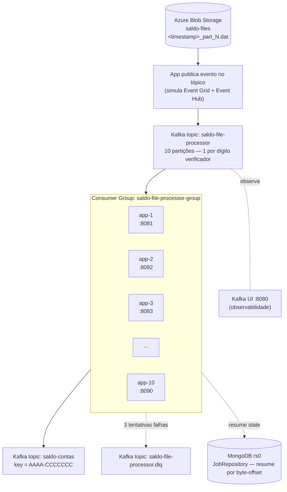
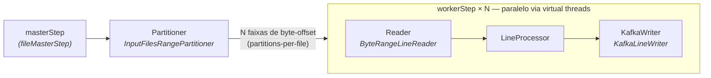

# Arquitetura

Duas visões: a **topologia do sistema** (do blob até a mensagem publicada) e o
**pipeline de processamento** por arquivo (o que acontece dentro de cada job).

## Topologia do sistema

Fonte Mermaid (editável)

> **Nota:** o Azurite não emula Event Grid — localmente, a própria aplicação publica o
> evento assim que termina de subir cada arquivo. Em Azure real essa ligação é
> **infraestrutura** (Event Grid System Topic na Storage Account, assinatura filtrando
> `BlobCreated`, destino = Event Hub) — nenhuma mudança de código, já que o Event Hub
> expõe um endpoint compatível com o protocolo Kafka nativamente.

**10 containers, 1 partição cada.** O tópico `saldo-file-processor` tem 10 partições
(uma por dígito verificador) e todas as instâncias (`app-1`..`app-10`) consomem no
**mesmo consumer group** — o Kafka atribui exatamente 1 partição a cada uma
automaticamente (validado: `kafka-consumer-groups --describe` mostra 10 hosts
distintos, 1 partição cada). Se um container cair, o Kafka reatribui a partição órfã
aos sobreviventes até ele voltar. `KAFKA_GROUP_INITIAL_REBALANCE_DELAY_MS=5000` dá
tempo dos 10 containers entrarem no grupo antes do primeiro rebalance, evitando uma
cascata de reassignments no cold start.

| Componente | Papel |
|---|---|
| `saldo-file-processor` (10 partições) | Evento "arquivo pronto" — 1 mensagem por arquivo, partição = dígito |
| `saldo-file-processor.dlq` | Arquivos que excederam `APP_FILE_PROCESSOR_MAX_ATTEMPTS` tentativas |
| `saldo-contas` | Saída: cada linha processada, key `AAAA-CCCCCCC` |
| MongoDB (`rs0`) | `JobRepository` — histórico de `JobInstance`/`StepExecution`, base do resume |
| Kafka UI (`:8080`) | Observa tópicos e o consumer group, não participa do fluxo |

## Pipeline de processamento — por arquivo

Fonte Mermaid (editável)

Cada mensagem consumida = **1 arquivo** = **1 execução do `saldoFileJob`**, síncrona: o
consumer só faz `ack` no Kafka depois que o job termina com `COMPLETED`
([FileProcessorConsumer](../src/main/java/br/com/saldo/batch/consumer/FileProcessorConsumer.java)).

| Etapa | Classe real | Comportamento de resiliência |
|---|---|---|
| **masterStep** | `fileMasterStep` (bean em [BatchConfig](../src/main/java/br/com/saldo/batch/config/BatchConfig.java)) | Orquestra 1 arquivo por execução do job |
| **Partitioner** | [InputFilesRangePartitioner](../src/main/java/br/com/saldo/batch/partition/InputFilesRangePartitioner.java) | Divide o arquivo em N faixas de byte-offset (`partitions-per-file`) |
| **workerStep** | bean `workerStep` | `chunk=5000` · fault-tolerant · retenta erro transiente do Kafka (3×) |
| **Reader** | [ByteRangeLineReader](../src/main/java/br/com/saldo/batch/reader/ByteRangeLineReader.java) | Salva a posição lida no `ExecutionContext` → **retoma do byte exato** se o processo parar no meio |
| **LineProcessor** | [LineProcessor](../src/main/java/br/com/saldo/batch/processor/LineProcessor.java) | Extrai agência+conta por offset fixo → monta a key `AAAA-CCCCCCC` |
| **KafkaWriter** | [KafkaLineWriter](../src/main/java/br/com/saldo/batch/writer/KafkaLineWriter.java) | `flush()` por chunk antes do commit → durabilidade, at-least-once |

### Identidade do job e retomada

Os `JobParameters` do `saldoFileJob` são só `{inputFile: <nome do arquivo>}` — como o
nome já é único por timestamp, essa é a identidade determinística do `JobInstance`. Se
o processo morrer no meio (crash, `docker kill`), a mensagem nunca foi confirmada; na
redelivery, o consumer detecta a execução anterior presa em `STARTED` (só pode ser
órfã — o Kafka garante um único consumer por partição) e a marca como `FAILED`,
liberando o Spring Batch para **retomar as partições incompletas** em vez de duplicar.
Validado matando o container no meio de um arquivo de 20MM linhas: retomou e completou
sozinho.

### Corrida rara no cold start — nunca perde o arquivo

`MongoJobInstanceDao.createJobInstance` (Spring Batch 6) faz um check-then-act sem lock
atômico — em um cold start com muitos containers entrando no consumer group ao mesmo
tempo, dois consumers podem, raramente, tentar criar a mesma `JobInstance`
simultaneamente, deixando uma órfã (sem `JobExecution` associada, erro
`Cannot find any job execution for job instance`).

Isso é dado de **saldo** — um arquivo nunca pode ficar sem processar por causa de um
problema de metadado. Por isso o consumer **não desiste** quando detecta uma identidade
órfã: `resolveWorkingIdentity` escala deterministicamente para uma variante nova
(`variant=1`, `2`, ...) até achar uma identidade utilizável, sem tocar em qual arquivo
físico é lido (o partitioner sempre lê o nome real do arquivo). DLQ fica reservado
**só** para falha real de processamento do conteúdo (`APP_FILE_PROCESSOR_MAX_ATTEMPTS`
tentativas verdadeiras esgotadas), nunca para esse tipo de corrida de metadado.

`KAFKA_GROUP_INITIAL_REBALANCE_DELAY_MS=5000` reduz bastante a chance da corrida
acontecer. Validado com stack limpa: em 10 arquivos gerados simultaneamente, 2
containers detectaram a variante órfã e escalaram automaticamente — os 10 arquivos
foram processados (50.000/50.000 registros na saída), DLQ vazio.

---

Ver também: [README](../README.md) · [docs/README.md](README.md) (Postman).
